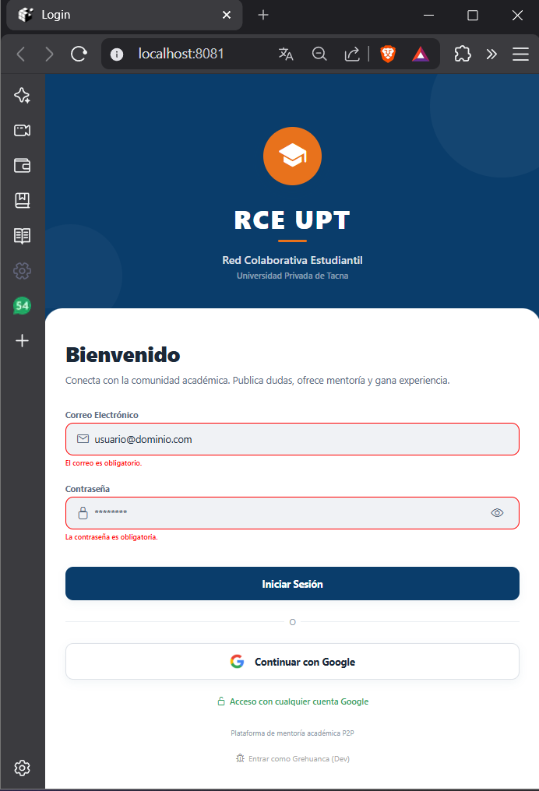
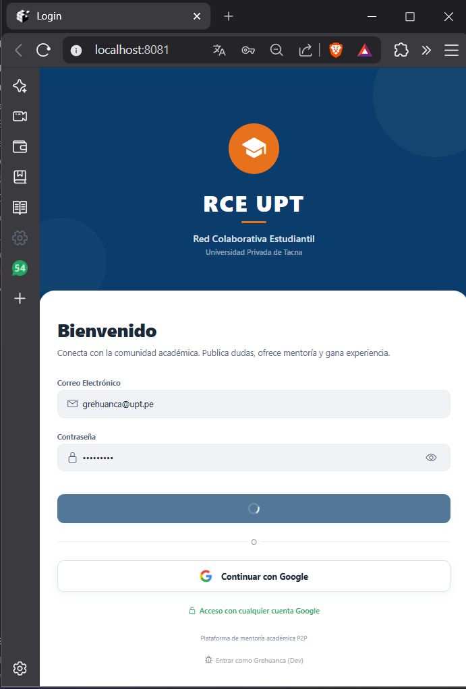

# SM2_EXAMEN_VALIDACIONES

**Curso:** Soluciones Móviles II  
**Alumno:** Gregory Brandon Huanca Merma  
**Código:** 2022073898  
**Fecha:** 02/06/2026  
**Repositorio:** https://github.com/GregoBHM/SM2_EXAMEN_VALIDACIONES

---

## ¿Qué pantalla elegí?

Elegí la pantalla de **Login** de mi proyecto **RCE UPT** (Red Colaborativa Estudiantil - Universidad Privada de Tacna). Esta pantalla es la entrada principal de la app, donde el usuario ingresa su correo institucional y contraseña para acceder a la plataforma.

La restructuré para implementar validaciones dinámicas con expresiones regulares, tal como se pide en el examen.

---

## Implementación Técnica

### Manejo del estado del formulario (CA1)

En React Native no existe el widget `Form` de Flutter como tal, pero el equivalente directo es manejar el estado de cada campo con `useState` y centralizar la validación en una función `validateForm()` que se dispara únicamente al presionar el botón de envío.

Los errores **no se muestran en cuadros de diálogo (Alert)**, sino que se renderizan como texto rojo directamente debajo de cada campo:

```javascript
// Estado del formulario
const [email, setEmail] = useState('');
const [password, setPassword] = useState('');
const [errors, setErrors] = useState({});

// Equivalente a _formKey.currentState!.validate()
const validateForm = () => {
  let newErrors = {};
  // ... validaciones
  setErrors(newErrors);
  return Object.keys(newErrors).length === 0;
};
```

Renderizado del error debajo del campo (sin popups):
```jsx
{errors.email ? <Text style={styles.errorText}>{errors.email}</Text> : null}
```

---

### Expresiones Regulares implementadas (CA2)

#### Campo 1 — Correo Electrónico
```javascript
const emailRegex = /^[^\s@]+@[^\s@]+\.[^\s@]+$/;
```
Esta expresión valida que el correo tenga el formato `usuario@dominio.extension`. Rechaza correos sin `@`, sin dominio o con espacios. Ejemplos:
- ✅ `grehuanca@upt.pe`
- ✅ `usuario@gmail.com`
- ❌ `correogmail.com`
- ❌ `correo@`

#### Campo 2 — Contraseña
```javascript
const passwordRegex = /^(?=.*[a-z])(?=.*[A-Z])(?=.*\d)[a-zA-Z\d]{8,}$/;
```
Esta expresión usa **lookaheads positivos** para verificar simultáneamente:
- `(?=.*[a-z])` → que exista al menos una letra minúscula
- `(?=.*[A-Z])` → que exista al menos una letra mayúscula  
- `(?=.*\d)` → que exista al menos un dígito numérico
- `{8,}` → longitud mínima de 8 caracteres

Ejemplos:
- ✅ `Examen123`
- ✅ `Hola2026`
- ❌ `examen123` (sin mayúscula)
- ❌ `EXAMEN123` (sin minúscula)
- ❌ `Examen` (sin número y menos de 8 chars)

---

### UX en la entrada de datos (CA3)

**Teclado óptimo por campo:**
```jsx
// Campo de correo → activa teclado con @ visible
keyboardType="email-address"

// Campo de contraseña → oculta los caracteres mientras se escribe
secureTextEntry={!showPassword}
```

**Botón de ojo para mostrar/ocultar contraseña:**
```jsx
<TouchableOpacity onPress={() => setShowPassword(!showPassword)}>
  <Ionicons name={showPassword ? "eye-off-outline" : "eye-outline"} size={20} />
</TouchableOpacity>
```

**Simulación de procesamiento asíncrono (2 segundos):**
```javascript
const handleEmailSubmit = () => {
  if (validateForm()) {
    setIsSubmittingForm(true);
    setTimeout(() => {
      setIsSubmittingForm(false);
    }, 2000); // bloquea el botón exactamente 2 segundos
  }
};
```
Durante esos 2 segundos el botón muestra un `ActivityIndicator` (equivalente al `CircularProgressIndicator` de Flutter) y queda deshabilitado para evitar múltiples envíos.

---

## Evidencias de Funcionamiento

### Captura 1 — Validaciones activas con errores en rojo

<!-- INSTRUCCION: saca pantallazo con campos vacios o datos malos y guardalo como evidencias/captura1_errores.png -->



---

### Captura 2 — Botón en estado de carga

<!-- INSTRUCCION: pon correo grehuanca@upt.pe y contraseña Examen123, presiona Iniciar Sesion y captura el spinner. Guardalo como evidencias/captura2_cargando.png -->



---

## Tecnología usada

- **Framework:** React Native con Expo (~54.0.33)
- **Proyecto base:** RCE UPT — Red Colaborativa Estudiantil UPT
- **Validaciones:** JavaScript nativo con RegExp
- **Navegación:** React Navigation